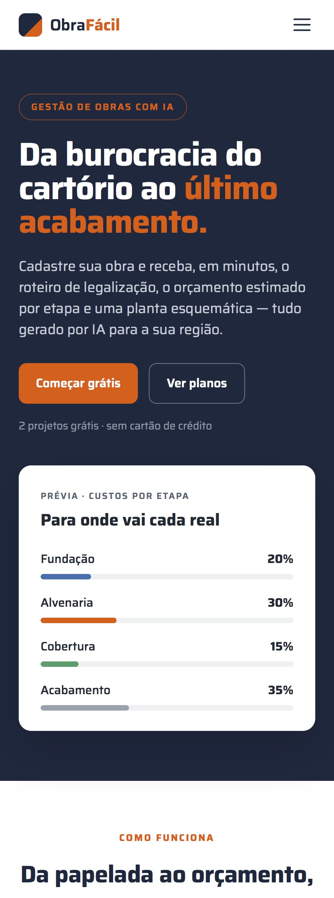
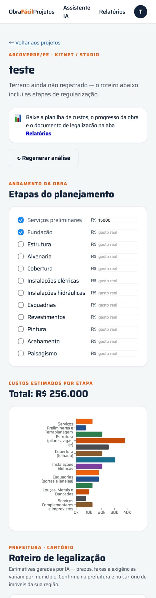

# Obra Fácil

Construction-management platform for the Brazilian market. Register a project and get, in minutes, an AI-generated permitting roadmap, a cost estimate broken down by phase, and a schematic floor plan — work that normally takes weeks of research and loose spreadsheets.

**[Live demo](https://obra-facil-eta.vercel.app)**

> The product UI is in Brazilian Portuguese, since permitting rules are region-specific.

<p align="center">
  
</p>

## What it does

Three automated steps replace the manual research a homeowner or small builder usually goes through:

| Step | Output |
|---|---|
| **Permitting roadmap** | Step-by-step approval path for the city hall and the property registry office, specific to the user's region — with required documents, deadlines and estimated fees per step |
| **Cost estimate by phase** | Predicted cost of each macro-phase (foundation, masonry, roofing, finishing…) for the project's region, exportable to a spreadsheet |
| **Schematic floor plan** | Preliminary room distribution generated for the lot's dimensions |

<p align="center">
  
</p>

## Stack

| Layer | Technology |
|---|---|
| API | .NET 8 Minimal API, EF Core, JWT |
| Database | PostgreSQL (production) / SQLite (local dev) |
| Frontend | React 18 + Vite + React Router |
| AI | Anthropic Claude API (project analysis) |
| Deploy | Render (API) + Neon (Postgres) + Vercel (frontend) — all on free tiers |

## Project structure

```
backend/ObraFacil.Api/   .NET 8 API (auth + projects + phases + analysis)
frontend/                React SPA
docs/screenshots/        Images used in this README
```

## Data model

```
users (id PK, name, email UNIQUE, password_hash, plan, created_at)
   └── projects (id PK, user_id FK→users, name, description, address,
                 budget, area_m2, status, start_date, expected_end, created_at)
          └── phases (id PK, project_id FK→projects, name, order, done, created_at)
```

Foreign keys use `ON DELETE CASCADE`. Unique index on `users.email`; indexes on `projects.user_id` and `phases(project_id, order)`.

## Endpoints

| Method | Route | Auth | Description |
|---|---|---|---|
| POST | `/api/auth/registrar` | — | Creates a user and returns a JWT |
| POST | `/api/auth/login` | — | Authenticates and returns a JWT |
| GET | `/api/projetos` | JWT | Lists the user's projects |
| GET | `/api/projetos/{id}` | JWT | Project detail |
| POST | `/api/projetos` | JWT | Creates a project (Free plan: max. 2) |
| POST | `/api/projetos/{id}/analise` | JWT | Generates the AI analysis (permitting, costs, floor plan) |
| GET | `/api/projetos/{id}/analise` | JWT | Returns the stored analysis |
| GET | `/health` | — | Health check |

Swagger UI is available at `/swagger`.

## Running locally

**API** (requires the .NET 8 SDK):

```bash
cd backend/ObraFacil.Api
dotnet run
# API on http://localhost:5000 — SQLite database is created automatically
```

**Frontend:**

```bash
cd frontend
npm install
echo "VITE_API_URL=http://localhost:5000" > .env.local
npm run dev
```

## Deploying for free

### 1. Database — Neon (free Postgres)

1. Create an account at https://neon.tech
2. Create a project and copy the **connection string** (`postgres://...`)

### 2. API — Render (free)

1. Create an account at https://render.com, then **New → Web Service**
2. Connect this repository. Root Directory: `backend/ObraFacil.Api`. Runtime: **Docker**
3. Environment variables:
   - `DATABASE_URL` — the Neon connection string
   - `JWT_SECRET` — a long random string (e.g. `openssl rand -hex 32`)
   - `FRONTEND_URL` — the Vercel URL (fill this in after step 3)
   - `ANTHROPIC_API_KEY` — your Anthropic API key (console.anthropic.com), used by the AI analysis
   - `ANTHROPIC_MODEL` — optional; defaults to `claude-sonnet-4-6` (use `claude-haiku-4-5` to cut cost)
4. Deploy and note the URL (e.g. `https://obra-facil-api.onrender.com`)

> Render's free tier sleeps after inactivity — the first request can take ~30s.

### 3. Frontend — Vercel (free)

1. Create an account at https://vercel.com, then **Add New → Project**
2. Connect this repository. Root Directory: `frontend` (framework: Vite)
3. Environment variable: `VITE_API_URL` — the Render API URL
4. Deploy, then go back to Render and set `FRONTEND_URL` to the Vercel URL

## Roadmap

- Replace `EnsureCreated()` with proper `dotnet ef migrations`
- Refresh tokens and safer storage than `localStorage`
- Editing and deleting projects; marking phases as complete
- Pro plan checkout (Stripe / Mercado Pago)
- Expand the AI assistant into full construction planning

---

Built by [Caíque Neves Ferreira](https://github.com/caique-neves-ferreira) · [LinkedIn](https://linkedin.com/in/caique-neves-ferreira)
